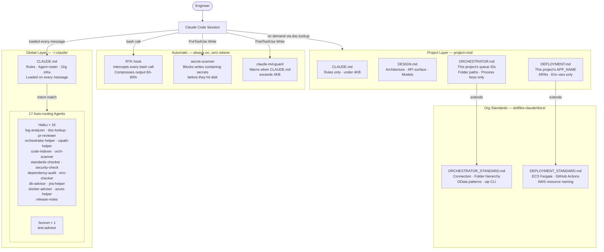

# Claude Project Framework

A token-efficient multi-agent Claude Code setup for development teams.
15 auto-routing agents, a two-layer documentation system, project templates, and
smart install scripts — all designed around one principle: **never pay for tokens you don't need.**

**Works with:** UiPath bots · C# libraries and APIs · Node.js/React apps · Python services

---

## Architecture Overview



**Three layers, one rule:** if it's the same across all projects → global standard. If it's unique to one project → Delta MD. If it's automatic safety → hook.

---

## Why This Exists — The Token Problem

When you open Claude Code on a project, Claude reads your `CLAUDE.md` file on **every single message** of the session. If that file is 17KB (not unusual for a project that's been running a while), you're spending ~4,250 tokens just on context overhead — before you've even asked anything.

Multiply that across a full session:

| Scenario | Tokens per message | 100-message session |
|---|---|---|
| Bloated 17KB CLAUDE.md | ~4,250 input tokens | 425,000 tokens of overhead |
| Trimmed 3.5KB CLAUDE.md | ~875 input tokens | 87,500 tokens of overhead |
| **Savings** | **79%** | **337,500 tokens saved** |

That's before counting model choice. Running a log analysis or doc lookup through Sonnet costs roughly **12× more** than running it through Haiku — for the exact same result.

This framework tackles both problems:

1. **Keep CLAUDE.md lean** — rules only, under 4KB. Detail lives in separate files loaded on demand.
2. **Route tasks to the cheapest model that can do the job** — 15 specialized agents, 14 on Haiku.
3. **Share org-wide standards globally** — never copy the same boilerplate into every project.

---

## Core Concepts

### 1. The Context Window Is Not Free

Every token sent to Claude costs money. Every token in your `CLAUDE.md`, every line of a file you paste, every message in a long session — all of it counts. Claude Code loads `CLAUDE.md` automatically, so its size directly multiplies your cost.

**What belongs in CLAUDE.md:**
- Rules, conventions, hard constraints
- Key file names and what they do
- What NOT to do (the non-obvious stuff)
- Pointers to other docs

**What does NOT belong in CLAUDE.md:**
- Full API signatures (put in DESIGN.md, load on demand)
- Endpoint lists (put in DESIGN.md)
- Deployment runbooks (put in DEPLOYMENT.md)
- Org-wide standards repeated in every project (put in global docs, inherit)

### 2. Agents — Delegate, Don't Load

When you ask Claude to review a git diff, it doesn't need to know your full project architecture. When you ask it to look up a queue ID, it doesn't need your test suite. Agents solve this by handling specific task types in isolation — they read only what they need and return a focused result.

**Without agents:**
```
You → "Review my diff" → Claude loads FULL project context → reviews diff
                         (paying for all that context you didn't need)
```

**With agents:**
```
You → "Review my diff" → Claude routes to pr-reviewer agent
                       → agent reads ONLY the git diff
                       → returns structured review
                       → main context never touched
```

Agents also run on **Haiku by default** — the cheapest Claude model. For tasks like log analysis, doc lookup, standards checking, and code review, Haiku performs identically to Sonnet at a fraction of the cost.

### 3. Delta MDs — Inherit, Don't Repeat

Every project in your org deploys to the same AWS setup, talks to the same Orchestrator tenant, follows the same Git workflow. Repeating that in every project's docs means paying to load it in every session.

The Delta MD system solves this with two layers:

```
Layer 1 — Global Standards (this repo, docs/)
  ORCHESTRATOR_STANDARD.md   ← your org's Orchestrator: URLs, auth, folder hierarchy, OData patterns
  DEPLOYMENT_STANDARD.md     ← your org's pipeline: ECS Fargate, GitHub Actions, AWS naming

Layer 2 — Project Delta MDs (per-project repo)
  ORCHESTRATOR.md   → "Extends: ORCHESTRATOR_STANDARD.md" + THIS project's queue IDs only
  DEPLOYMENT.md     → "Extends: DEPLOYMENT_STANDARD.md" + THIS project's APP_NAME + ARNs only
  CLAUDE.md         → rules only, under 4KB
  DESIGN.md         → architecture, API surface, models — loaded only when working on design
```

The `doc-lookup` agent handles the merge automatically — it loads the global standard first, then the project delta, and project values win on any overlap.

**Result:** A project `ORCHESTRATOR.md` goes from 5KB of repeated boilerplate to 1KB of project-specific values. A `DEPLOYMENT.md` goes from 12KB to 1.5KB.

---

## Full Setup Sequence

Follow this in order. Nothing is optional until marked.

---

### Step 1 — Install Claude Code

```bash
npm install -g @anthropic-ai/claude-code
claude --version   # verify
```

Sign in with your Anthropic account when prompted. This is the foundation everything else runs on.

---

### Step 2 — Clone This Repo

```bash
# Linux / Mac
git clone https://github.com/kakoritz/claude-project-framework.git ~/claude-project-framework
cd ~/claude-project-framework

# Windows (PowerShell)
git clone https://github.com/kakoritz/claude-project-framework.git $env:USERPROFILE\claude-project-framework
cd $env:USERPROFILE\claude-project-framework
```

---

### Step 3 — Run the Install Script

Deploys all 15 agents, CLAUDE.md, RTK.md, and hook files to `~/.claude/`.

```bash
# Linux / Mac
chmod +x install.sh && ./install.sh

# Windows
.\install.ps1
```

If you already have a `CLAUDE.md`, it will prompt you: **Replace / Merge / Skip**. Choose Merge if you have personal content you want to keep — it generates a Claude Code prompt to do the merge intelligently.

---

### Step 4 — Wire the Hooks

Adds secret-scanner and claude-md-guard to your `settings.json`. Checks before inserting — safe to run multiple times.

```bash
# Linux / Mac
./wire-hooks.sh

# Windows
.\wire-hooks.ps1
```

Restart Claude Code after this step.

---

### Step 5 — Install the GitHub CLI

Required for `pr-reviewer` and `release-notes` agents to read diffs and git history.

```bash
# Windows
winget install GitHub.cli

# Mac
brew install gh

# Linux
sudo apt install gh   # or see https://cli.github.com
```

```bash
gh auth login   # one-time authentication
```

---

### Step 6 — Install Stack-Specific CLIs

Install only what applies to your work:

**UiPath developers:**
```bash
npm install -g @uipath/uipath-cli
uip auth login    # one-time — authenticates to your Orchestrator
```
Required for `orchestrator-helper` to do live folder/queue/process lookups. Without it, the agent falls back to reading `ORCHESTRATOR.md` only.

**.NET / C# developers:**
```bash
# Install .NET SDK from https://dot.net/download
dotnet --version   # verify
```
Required for `dependency-audit` to check C# package vulnerabilities.

**Node.js developers:**
```bash
# Install from https://nodejs.org
node --version && npm --version   # verify
```
Required for `dependency-audit` to run `npm outdated` and `npm audit`.

**Python developers:**
```bash
# Install from https://python.org
python3 --version && pip --version   # verify
pip install pip-audit   # optional — adds vulnerability scanning
```

**AWS / ECS work:**
```bash
# Windows
winget install Amazon.AWSCLI

# Mac
brew install awscli

# Verify
aws --version
aws configure   # one-time: access key, secret, region
```

**Docker / containerization:**
Install Docker Desktop from https://www.docker.com/products/docker-desktop

---

### Step 7 — Wire RTK (Windows Only)

RTK compresses bash command output before Claude reads it — 60–90% fewer tokens on terminal output. See the [RTK section](#rtk--token-optimizer-for-bash-output) for full details.

1. Install the RTK binary (see `windows/RTK.md` for your org's install method)
2. Verify: `rtk --version` and `rtk gain`
3. Add to `settings.json` manually — this is the one entry `wire-hooks.ps1` does NOT add (RTK is a separate tool):

```json
"PreToolUse": [
  {
    "matcher": "Bash",
    "hooks": [{"type": "command", "command": "rtk hook claude"}]
  }
]
```

> The `wire-hooks.ps1` script preserves any existing `PreToolUse` entries — just add the RTK block to the array alongside what wire-hooks added.

---

### Step 8 — Install the UiPath Marketplace Plugin (Optional)

Gives Claude Code live access to UiPath Orchestrator data through MCP.

In Claude Code terminal: `/install-plugin uipath@uipath-marketplace`

Or add to `settings.json`:
```json
"enabledPlugins": {
  "uipath@uipath-marketplace": true
}
```

---

### Step 9 — Set Up Your First Project

```bash
# Linux / Mac
./new-project.sh

# Windows
.\new-project.ps1
```

Pick a type (UiPath Bot / C# Library / C# API / Web UX / Python). The script creates the project folder with pre-populated Claude MD files. Fill in the `[placeholder]` values — takes about 5 minutes.

**UiPath projects:** the generated folder includes `STANDARDS.md` already. Copy it to your project root if scaffolding into an existing project.

---

### Step 10 — Fill In Your Org's Global Docs (One-Time, Team Lead)

Someone on the team does this once. Everyone else inherits it.

1. **`CLAUDE.md`** — add your name, org, stack, infrastructure URLs
2. **`docs/ORCHESTRATOR_STANDARD.md`** — add your Orchestrator tenant, folder hierarchy
3. **`docs/DEPLOYMENT_STANDARD.md`** — add your AWS account ID, GitHub org name
4. Push to your own **private** fork of this repo
5. Team clones your private fork — not this public one

---

### Verify Everything

```bash
# Agents live?
ls ~/.claude/agents/   # should show 15 .md files

# Hooks wired?
cat ~/.claude/settings.json | grep -A5 "hooks"

# CLIs ready?
git --version && gh --version
uip --version 2>/dev/null || echo "uip: not installed"
dotnet --version 2>/dev/null || echo "dotnet: not installed"

# RTK (Windows — run in PowerShell)
rtk --version
rtk gain
```

---

## Quick Start

```bash
# Clone
git clone https://github.com/kakoritz/claude-project-framework.git ~/claude-project-framework
cd ~/claude-project-framework

# Linux / Mac
chmod +x install.sh && ./install.sh

# Windows (PowerShell — no admin needed)
.\install.ps1
```

Open any project in Claude Code. The 15 agents are live immediately.

---

## The 15 Agents

Agents auto-route — Claude recognizes the intent from your message and delegates.
No slash commands. No extra configuration. Just ask naturally.

| Agent | Model | Auto-triggers when you say... |
|---|---|---|
| `log-analyzer` | Haiku | Share error logs, stack traces, crash output |
| `doc-lookup` | Haiku | "What does DESIGN.md say about X" · "where is Y documented" |
| `pr-reviewer` | Haiku | "Review this diff" · "check before I commit" · "any issues here" |
| `orchestrator-helper` | Haiku | "What's the queue ID for..." · "which folder is TIR in" · OData patterns · uip CLI |
| `uipath-helper` | Haiku | "REFramework question" · "prep for code review" · XAML design |
| `code-indexer` | Haiku | "What classes are in this file" · "show me the structure of X" |
| `orch-scanner` | Haiku | "Scan orchestrator" · "refresh ORCHESTRATOR.md" · "get live queue IDs" |
| `standards-checker` | Haiku | "Does this meet standards" · "any naming violations" · "check before PR" |
| `security-check` | Haiku | "Security review" · "any injection risks" · "check for exposed secrets" |
| `release-notes` | Haiku | "Update release notes" · "generate changelog" · "what changed in v2.1" |
| `test-advisor` | **Sonnet** | "Write tests for this" · "what's not covered" · "audit test coverage" |
| `dependency-audit` | Haiku | "Are my packages up to date" · "any vulnerable dependencies" |
| `env-checker` | Haiku | "Ready to deploy" · "check my env vars" · "anything missing from .env" |
| `db-advisor` | Haiku | Share SQL · "review this stored proc" · "index suggestions" |
| `jira-helper` | Haiku | "Write this as a Jira ticket" · "format my commit message" · "acceptance criteria" |
| `docker-advisor` | Haiku | Share Dockerfile · "why is my image large" · "ECS container patterns" |
| `azure-helper` | Haiku | "MSAL not working" · "app registration setup" · AADSTS error codes |

**`test-advisor` runs on Sonnet** because writing good tests requires real code reasoning.
Everything else runs on Haiku — fast, cheap, and more than capable for lookup and review tasks.

### How Auto-Routing Works

Each agent has a `description` field that Claude reads when deciding what to delegate.
Claude matches your message intent against those descriptions and routes accordingly.
You never need to know which agent handles what — just ask naturally.

```
You: "Are any of my npm packages out of date?"
Claude: [routes to dependency-audit → runs npm outdated → returns structured table]

You: "Review my diff before I push"
Claude: [routes to pr-reviewer → reads git diff only → returns findings]

You: "What does ORCHESTRATOR.md say about the TIR queue IDs?"
Claude: [routes to doc-lookup → loads global standard + project delta → returns exact values]
```

### Project-Specific Agents

For anything large or project-specific, add agents to `.claude/agents/` at the project root.
They extend the global 15 — they don't replace them.

```
your-project/
  .claude/
    agents/
      swagger-lookup.md   ← keeps a 5MB NSwag file out of main context window
      new-agent.md        ← scaffolds new agents following team standards
```

Good candidates for project agents: large reference files (Swagger specs, log archives),
project-specific workflows that run repeatedly, vendor API lookups.

---

## Setting Up a New Project

```bash
# Linux / Mac
./new-project.sh

# Windows
.\new-project.ps1
```

```
DCLI New Project
================
Project name: MyNewBot.Performer

Project type:
  [1] UiPath Bot       (Dispatcher or Performer)
  [2] C# Library       (reusable .NET library)
  [3] C# API           (ASP.NET Core minimal API)
  [4] Web UX           (Node.js + React frontend + backend)
  [5] Python           (script, agent, or service)

Type (1-5): 1

Created: D:\repos\MyNewBot.Performer\
  OK CLAUDE.md
  OK STANDARDS.md
  OK ORCHESTRATOR.md

Next: fill in the [placeholder] values in each MD file.
      ORCHESTRATOR.md needs your queue IDs and folder paths.
```

All `{{PROJECT_NAME}}` and `{{DATE}}` placeholders are replaced automatically.
What's left to fill in: your project description, queue IDs, folder paths, and any project-specific constraints.

---

## UiPath Coding Standards

`STANDARDS_UIPATH.md` is a complete standards file for any UiPath project. Copy it to your project root as `STANDARDS.md` — the `standards-checker` and `uipath-helper` agents read it automatically.

**Covers:**
- Argument prefixes: `in_`, `out_`, `io_` — no bare names
- Variable type prefixes: `str`, `dt`, `dtbl`, `int`, `bool`, `arr`, `dict`
- Workflow file tag conventions: `[BL]`, `[DB]`, `[Controller]`, `[Queue]`, etc.
- Main.xaml rules (framework-only — no custom logic)
- Config file rules (no hardcoded values)
- Logging: `[DCLI] Log Execution Event` — not bare Log Message
- Error handling patterns (Try-Catch with specific exception types)
- Pre-code-review checklist
- C# naming standards
- Python naming standards

---

## Customizing for Your Org

**Step 1 — Fill in `CLAUDE.md`**
Replace `[Your Name]`, `[Your Org]`, `[Your primary stack]`, and the infrastructure table
with your actual values. Keep it under 4KB.

**Step 2 — Fill in `docs/ORCHESTRATOR_STANDARD.md`**
Replace `[YOUR_ORG]`, `[YOUR_TENANT]`, and the folder hierarchy table with your
UiPath Orchestrator tenant details. This becomes the single source of truth for
all Orchestrator context across every project.

**Step 3 — Fill in `docs/DEPLOYMENT_STANDARD.md`**
Replace `[YOUR_SANDBOX_ACCOUNT]` and `[YOUR_GITHUB_ORG]`. Every new web app project
will extend from this instead of repeating the full runbook.

**Step 4 — Keep your filled version private**
Fork this repo or create a new private repo. Your filled-in version will contain
infrastructure URLs, account IDs, and folder paths — keep it internal.
Use this public repo as the starting template only.

---

## RTK — Token Optimizer for Bash Output

RTK (Rust Token Killer) is a transparent proxy that sits between Claude and every bash command it runs. It intercepts the **output** of shell commands and compresses it before Claude reads it — 60–90% fewer tokens on terminal output, with no change to your workflow.

### How It Works

RTK is wired as a `PreToolUse:Bash` hook in `settings.json`. Every time Claude runs a bash command, RTK intercepts it first:

```
Claude wants to run: git status
  → PreToolUse:Bash fires
  → RTK receives the command
  → RTK runs it, compresses the output
  → Claude gets a lean summary (not 500 lines of raw output)
  → Zero behavior change — Claude still gets all the information it needs
```

**It intercepts ALL bash calls — not just git.** File listings, npm output, dotnet builds, log tails — anything Claude runs in a shell goes through RTK. For commands RTK has handlers for, output is compressed. For commands it doesn't recognize, it passes through unchanged with zero interference.

**It works in VS Code and terminal equally.** RTK is wired to `settings.json`, which Claude Code reads regardless of whether you're in the VS Code extension or a standalone terminal. Same hook, same savings, both environments.

### Key Commands

```bash
rtk --version          # Verify RTK is installed correctly
rtk gain               # Show token savings from current session
rtk gain --history     # Show savings across all past sessions
rtk discover           # Analyze your Claude Code history — shows where RTK IS saving
                       # tokens and where it ISN'T (gaps you might address)
rtk proxy <cmd>        # Run a command through RTK manually (for debugging)
```

Run `rtk discover` after a few sessions. It reads your actual Claude Code history and tells you which commands are generating the most output and where the biggest savings opportunities are.

### RTK Is Windows-Only in This Framework

RTK is included in `windows/RTK.md` and deployed by `install.ps1`. It requires a separate binary install — see `windows/RTK.md` for verification steps.

> ⚠️ **Name collision:** If `rtk gain` fails after install, you may have a different `rtk` binary (`reachingforthejack/rtk`, the Rust Type Kit) on your PATH. `which rtk` will show which one you have.

### Wiring RTK Into settings.json

RTK requires a manual entry in `settings.json` — add it to your `PreToolUse` hooks array alongside the secret-scanner:

```json
"PreToolUse": [
  {
    "matcher": "Bash",
    "hooks": [{"type": "command", "command": "rtk hook claude"}]
  },
  {
    "matcher": "Write",
    "hooks": [{"type": "command", "command": "%USERPROFILE%\\.claude\\hooks\\secret-scanner.ps1"}]
  }
]
```

---

## install.ps1 / install.sh — What They Do

Safe to run on any existing machine. The scripts never overwrite machine-specific config.

| File | Behavior |
|---|---|
| `~/.claude/agents/*.md` | Always deployed / updated — creates folder if missing |
| `~/.claude/CLAUDE.md` (no existing file) | Copied directly |
| `~/.claude/CLAUDE.md` (already has framework content) | Silently skipped |
| `~/.claude/CLAUDE.md` (exists, different content, under 4KB) | Prompt: Replace / Merge / Skip |
| `~/.claude/CLAUDE.md` (exists, over 4KB) | Same prompt + size warning |
| Replace | Timestamps backup, copies framework version |
| Merge | Timestamps backup, prints ready-to-paste Claude Code prompt to merge intelligently |
| `settings.json` | **Never touched** |
| `settings.local.json` | **Never touched** |
| `plugins/` | **Never touched** |

The **Merge** option generates a prompt you paste into Claude Code. Claude reads both files, keeps your personal context, adds the DCLI global standards where missing, and keeps the result under 4KB.

---

## Hooks — Zero-Token Automation

Hooks are shell scripts that fire on Claude Code events. They run entirely on your machine — no API call, no model, no tokens. The only token cost is when a hook fires a warning and Claude reads it (~20 tokens). Otherwise: free.

This framework ships two hooks, both wired to the `Write` tool:

### secret-scanner (PreToolUse:Write)

Fires **before** Claude writes any file. Scans the content for secret patterns and **blocks the write** if it finds one.

```
Claude tries to write appsettings.json containing "password=hunter2"
  → secret-scanner fires
  → pattern matched: password\s*=\s*.{4,}
  → exits non-zero → write BLOCKED
  → Claude sees the error, stops, explains what it found
```

Patterns it catches: AWS access keys, Anthropic/OpenAI API keys, private keys, `password=`, `client_secret=`, `api_key=` with values. Skips `.env.example` and `.env.sample` — those are intentionally showing key names.

**Why this matters:** `env-checker` and `security-check` agents only run when you ask them. This hook is always on. You can't forget to run it.

### claude-md-guard (PostToolUse:Write)

Fires **after** Claude writes any `CLAUDE.md` file. Checks the file size. If over 4KB, outputs a warning Claude reads on the next turn.

```
Claude writes a CLAUDE.md that grew to 6.2KB during a session
  → claude-md-guard fires
  → "CLAUDE.md is 6.2KB — over the 4KB limit"
  → Claude trims before continuing
```

**Why this matters:** CLAUDE.md is loaded on every message. Letting it drift to 6KB costs 79% more context overhead per message than keeping it under 4KB. The hook enforces the rule automatically.

### Wiring Hooks Into settings.json

`install.sh` / `install.ps1` deploy the hook **files** but do not touch `settings.json`.
Run the dedicated wiring script to safely merge the hooks in:

```bash
# Linux / Mac — after install.sh
./wire-hooks.sh

# Windows — after install.ps1
.\wire-hooks.ps1
```

The wire script:
1. Backs up `settings.json` with a timestamp before touching it
2. **Checks if each hook is already wired** — skips if present, adds only if missing
3. Merges into the existing hooks array — never replaces your full `settings.json`
4. Safe to run multiple times — idempotent

Output:
```
Wire Hooks into settings.json
==============================
  Backup: ~/.claude/settings.json.bak.20260604-143021
  Added: secret-scanner (PreToolUse:Write)
  Added: claude-md-guard (PostToolUse:Write)
  settings.json updated.

Done. Restart Claude Code to activate hooks.
```

Your existing hooks (RTK, any others) are preserved — the script only appends to the arrays.

---

## Prerequisites

See `SETUP.md` for full CLI install instructions. Short version:

| Tool | Required for | Quick install |
|---|---|---|
| `git` | All agents | Built-in / git-scm.com |
| `gh` | pr-reviewer, release-notes | `winget install GitHub.cli` |
| `uip` | orchestrator-helper, orch-scanner | `npm install -g @uipath/uipath-cli` |
| `aws` | docker-advisor, env-checker | `winget install Amazon.AWSCLI` |
| `dotnet` | dependency-audit (C#) | dot.net/download |
| `node/npm` | dependency-audit (JS) | nodejs.org |
| `docker` | docker-advisor | Docker Desktop |

Agents degrade gracefully — if a tool isn't installed, the agent says so and gives you the install command.

---

## Repo Structure

```
claude-project-framework/
  agents/                      ← 15 global agents (auto-deployed, model names from config.yaml)
  docs/
    ORCHESTRATOR_STANDARD.md   ← org-wide Orchestrator reference (fill in your values)
    DEPLOYMENT_STANDARD.md     ← org-wide ECS/GitHub Actions pipeline (fill in your values)
  hooks/
    secret-scanner.sh/.ps1     ← PreToolUse:Write — blocks writes with secrets
    claude-md-guard.sh/.ps1    ← PostToolUse:Write — warns when CLAUDE.md > 4KB
  templates/
    uipath-bot/                ← CLAUDE.md, STANDARDS.md, ORCHESTRATOR.md
    csharp-library/            ← CLAUDE.md, DESIGN.md
    csharp-api/                ← CLAUDE.md, DESIGN.md, DEPLOYMENT.md
    nodejs-react/              ← CLAUDE.md, DESIGN.md, DEPLOYMENT.md, ORCHESTRATOR.md
    python/                    ← CLAUDE.md, DESIGN.md
  tests/
    README.md                  ← Agent test matrix + sample inputs for manual verification
  windows/
    RTK.md                     ← RTK token optimizer (Windows only)
  .github/workflows/
    validate.yml               ← CI: CLAUDE.md size, Extends: lines, placeholders, no .env
  config.yaml                  ← Model names — update here, re-run install to propagate
  CLAUDE.md                    ← global Claude context template (fill in your org)
  STANDARDS_UIPATH.md          ← UiPath coding standards (copy to project as STANDARDS.md)
  SETUP.md                     ← CLI prerequisites and MCP server setup
  validate.sh / validate.ps1   ← Check framework setup and project doc health
  install.sh / install.ps1     ← Deploy agents, hooks, CLAUDE.md
  wire-hooks.sh / wire-hooks.ps1 ← Wire hooks + RTK into settings.json
  new-project.sh / new-project.ps1 ← Interactive project scaffold
```

---

## The Payoff

| Without this framework | With this framework |
|---|---|
| 17KB CLAUDE.md loaded every message | 3.5KB CLAUDE.md — 79% less context overhead |
| Same model for everything | Haiku for 14/15 tasks — ~12× cheaper per lookup |
| Org standards copy-pasted into every project | One global standard, project Delta inherits |
| New project = blank folder, figure it out | New project = scaffold script, MDs ready in 30 seconds |
| No structure on what Claude reads when | Explicit doc loading table — Claude knows what to load and when |
| Agent that reviews logs needs full project context | log-analyzer reads the log only, nothing else |

---

## Keeping Models Up to Date

All 15 agents reference model names from a single file: `config.yaml`.

```yaml
models:
  haiku:  claude-haiku-4-5-20251001
  sonnet: claude-sonnet-4-6
  opus:   claude-opus-4-8
```

When Anthropic releases new models, update `config.yaml` and re-run `install.sh` / `install.ps1`. The install script substitutes the new names into every agent file on copy — you never edit agent files directly for model updates.

---

## Validating Your Setup

Run after install or after changing project docs to catch problems before they affect a session.

```bash
# Linux / Mac
./validate.sh                              # checks global install
./validate.sh --project /path/to/project   # checks a specific project

# Windows
.\validate.ps1                             # checks global install
.\validate.ps1 -ProjectDir D:\repos\MyProject
```

**What it checks:**

| Check | Pass | Fail |
|---|---|---|
| Agent count | 15 agents installed | Fewer than 15 — re-run install |
| CLAUDE.md size | Under 4KB | Over 4KB — move detail to DESIGN.md |
| Delta MD Extends: lines | Present | Missing — add global standard reference |
| Unfilled placeholders | None found | `[YOUR_ORG]` etc. still in files |
| Hooks wired | Both hooks in settings.json | Run wire-hooks script |

Exits with code 1 on errors so it can be used in CI scripts.

---

## CI / GitHub Actions

The framework ships a GitHub Actions workflow that runs on every PR and push to `development`. No setup needed beyond adding it to your repo.

```
.github/workflows/validate.yml
```

**What the CI job checks:**
- `CLAUDE.md` is under 4KB — fails the build if over
- `ORCHESTRATOR.md` and `DEPLOYMENT.md` have `Extends:` lines — warns if missing
- No `[YOUR_ORG]` / `[your-value]` placeholders left unfilled — warns
- No `.env` file committed — fails the build if found

The job runs entirely with shell commands — no Anthropic API, no cost. It's deterministic. Failed checks appear inline on the PR with the exact file and line number.

To add it to your project repo, copy `.github/workflows/validate.yml` into your project.

---

## Testing the Agents

Agents are language model instructions — they can't be unit tested like code. Behavior verification requires running them against real inputs.

`tests/README.md` contains:
- A test matrix for all 15 agents (trigger phrase → expected behavior)
- Sample inputs for the non-obvious ones (stack traces, SQL procs, Dockerfiles)
- A logging table to record pass/fail per engineer

**Recommended:** run the test matrix as a team exercise in your first two sessions. Two weeks of real usage surfaces anything broken faster than synthetic inputs. Log results in the table so the team knows what's been verified.

---

## Troubleshooting

**Agent isn't triggering**
Agents route by matching your message against their `description` field. If one isn't firing, try phrasing closer to the trigger examples in the agent table. Also confirm agents are installed: `ls ~/.claude/agents/` should show 17 files.

**`uip` command not found**
`orchestrator-helper` falls back to reading `ORCHESTRATOR.md` statically when `uip` isn't installed — it still works, just no live Orchestrator queries. Install: `npm install -g @uipath/uipath-cli` then `uip auth login`.

**`gh auth` expired**
`pr-reviewer` and `release-notes` need a live GitHub session. Run `gh auth login` to re-authenticate. Agents fall back to reading local git history when gh auth fails.

**ANTHROPIC_API_KEY missing or expired**
Claude Code won't start. Set the key: `export ANTHROPIC_API_KEY=sk-ant-...` (Linux/Mac) or `$env:ANTHROPIC_API_KEY="sk-ant-..."` (PowerShell). Add to your shell profile to persist.

**Hooks aren't firing**
1. Confirm hook files exist: `ls ~/.claude/hooks/`
2. Confirm hooks are wired: `cat ~/.claude/settings.json | grep -A5 hooks`
3. If not wired: run `./wire-hooks.sh`
4. Restart Claude Code after any settings.json change

**`rtk gain` fails with "command not found"**
Either RTK isn't installed, or a different `rtk` binary is on your PATH (name collision with Rust Type Kit). Run `which rtk` — if it points to the wrong binary, install the correct RTK and ensure it takes PATH priority.

**secret-scanner blocking a legitimate file**
Add `# noscan` anywhere in the file content to bypass the scanner for that write. For test files, rename to `*.test.*` or `*.spec.*` — those are automatically excluded.

**CLAUDE.md keeps triggering the 4KB guard**
The guard fires at 4096 bytes. Move API signatures, endpoint lists, and runbooks to `DESIGN.md`, `ORCHESTRATOR.md`, or `DEPLOYMENT.md`. CLAUDE.md should contain rules and file names only.

**`validate.sh` shows unfilled [placeholders]**
Open the flagged MD files and replace `[YOUR_ORG]`, `[YOUR_TENANT]`, etc. with your actual values. These are the org-specific fields in `CLAUDE.md`, `ORCHESTRATOR_STANDARD.md`, and `DEPLOYMENT_STANDARD.md`.

**GitHub Actions validate job failing**
The workflow checks: CLAUDE.md size, Extends: lines, unfilled placeholders, no committed .env. Read the job output — it pinpoints the exact file and line.

---

## Contributing

Issues and PRs welcome. Stack extensions (Java, Go, Terraform, etc.) are a great place to start.
